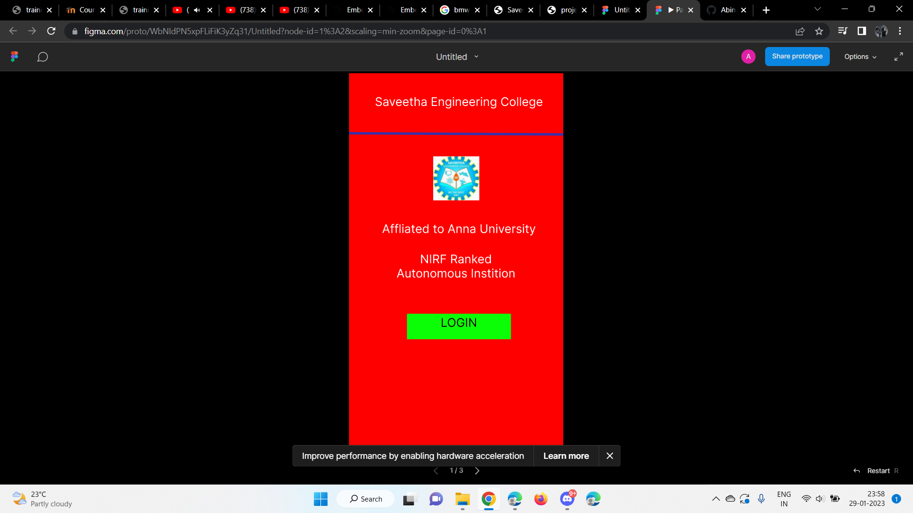
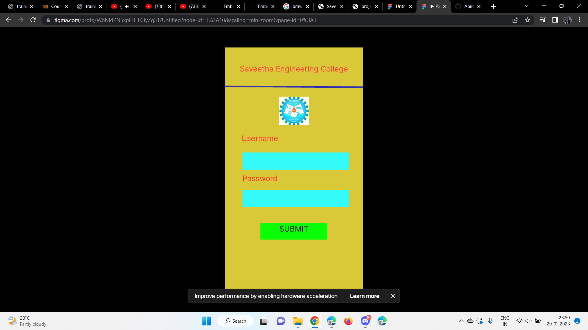
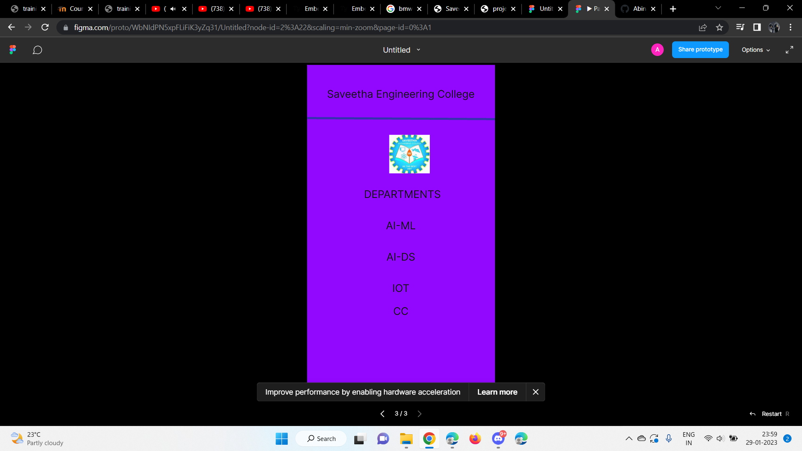

# Event Registration Web Application

## AIM:
To design, develop and deploy a web application for event registration.

## DESIGN STEPS:

### Step 1:
Create a new frame.

### Step 2:
Select any one preset size of your choice.

### Step 3:
Select the shapes you need.

### Step 4:
Import images as needed.

### Step 5:
Create pages based on your need and link them.

### Step 6:

Validate the HTML and CSS code.

### Step 6:

Publish the website in the given URL.

## DESIGN TOOL:
Figma

## Code:
```
/* Home Page */
position: relative;
width: 361px;
height: 641px;
background: #FF0000;

/* Login Page */
position: relative;
width: 360px;
height: 640px;
background: #D9C939;

/* Saveetha Engineering College */
position: absolute;
width: 289px;
height: 32px;
left: 35px;
top: 44px;
font-family: 'Inter';
font-style: normal;
font-weight: 400;
font-size: 20px;
line-height: 24px;
text-align: center;
color: #131212;

/* DEPARTMENTS */
position: absolute;
width: 289px;
height: 32px;
left: 38px;
top: 236px;
font-family: 'Inter';
font-style: normal;
font-weight: 400;
font-size: 20px;
line-height: 24px;
text-align: center;
color: #131212;

/* AI-ML */
position: absolute;
width: 289px;
height: 32px;
left: 35px;
top: 296px;
font-family: 'Inter';
font-style: normal;
font-weight: 400;
font-size: 20px;
line-height: 24px;
text-align: center;
color: #131212;

/* AI-DS */
position: absolute;
width: 289px;
height: 32px;
left: 35px;
top: 356px;
font-family: 'Inter';
font-style: normal;
font-weight: 400;
font-size: 20px;
line-height: 24px;
text-align: center;
color: #131212;

/* IOT */
position: absolute;
width: 289px;
height: 32px;
left: 35px;
top: 416px;
font-family: 'Inter';
font-style: normal;
font-weight: 400;
font-size: 20px;
line-height: 24px;
text-align: center;
color: #131212;

/* CC */
position: absolute;
width: 289px;
height: 32px;
left: 35px;
top: 460px;
font-family: 'Inter';
font-style: normal;
font-weight: 400;
font-size: 20px;
line-height: 24px;
text-align: center;
color: #131212;

/* Line 3 */
position: absolute;
width: 361.01px;
height: 0px;
left: 0px;
top: 104px;
border: 4px solid #3432AD;
transform: rotate(0.32deg);

/* Logo 3 */
position: absolute;
width: 78px;
height: 74px;
left: 157px;
top: 134px;
background: url(download.jpg);
```
## OUTPUT:




## RESULT:
The program to design, develop and deploy a web application for event registration is completed successfully.